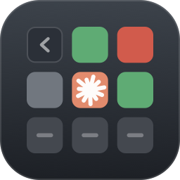
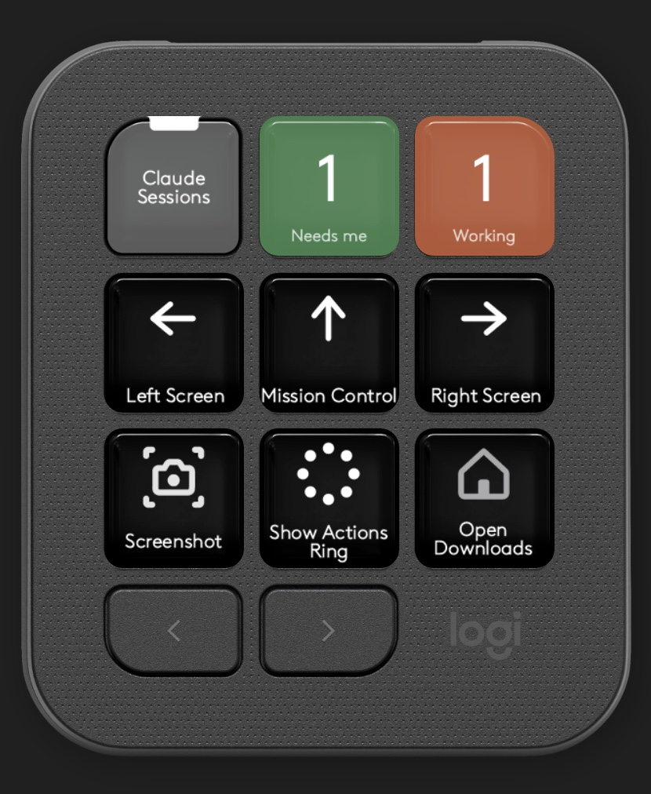

# ClaudeWarp

Live status of every [Claude Code](https://claude.com/claude-code) session running in a
[Warp](https://www.warp.dev) pane, on the LCD keys of a **Logitech MX Creative Keypad**.

One keypad page per Warp tab. Press a key to jump to that pane.

```
        Warp tab 1                    Warp tab 2                 Warp tab 3
┌───────┬───────┬───────┐     ┌───────┬───────┬───────┐   ┌───────┬───────┬───────┐
│ ←back │  api  │  api  │     │ ←back │ docs  │       │   │ ←back │ infra │       │
│       │ main  │  fix  │     │       │ main  │       │   │       │ main  │       │
├───────┼───────┼───────┤     ├───────┼───────┼───────┤   ├───────┼───────┼───────┤
│  web  │  web  │       │     │       │       │       │   │       │       │       │
│ main  │ test  │       │     │       │       │       │   │       │       │       │
├───────┼───────┼───────┤     ├───────┼───────┼───────┤   ├───────┼───────┼───────┤
│  esc  │/clear │/compac│     │  esc  │/clear │/compac│   │  esc  │/clear │/compac│
└───────┴───────┴───────┘     └───────┴───────┴───────┘   └───────┴───────┴───────┘
         ◀  ▶  the physical page buttons walk tab → tab; past the last tab they do nothing
```

Each tile is filled with its session's state colour, and moves when the session does — a busy tile
runs a sweep bar along its bottom edge, a tile that needs you blinks — so the deck is readable from
across the room without reading it:

| Colour | State | Comes from |
|---|---|---|
| 🟠 coral | **busy** — Claude is working | `UserPromptSubmit`, `PreToolUse`, `PostToolUse` |
| 🟢 green | **done** — your turn | `Stop` |
| 🔴 red | **attention** — Claude is blocked on you | `PermissionRequest`, and `Notification` matched to `permission_prompt` |
| ⚫ grey | **idle** — started, nothing sent yet | `SessionStart` |

The text on a tile is the project (the git top level, not the current directory) and what that
session is *about*, taken from Claude Code's own session name.

Red is kept rare on purpose. `Notification` is a family of unrelated events — a permission prompt
blocking a tool call, but also the "waiting for your input" nudge a minute after a turn ends, plus
auth and agent-lifecycle messages. If all of them turned a tile red, every finished session would
eventually go red and red would stop meaning anything. The hook is registered with the
`permission_prompt` matcher so it only hears the one that is genuinely an alarm; a turn that merely
finished stays green, which already says "your move".

There are also two keys for your home page, outside the folder, each a single number filling the key:

- **Needs me** — coloured by the same palette as the tiles: red how many are blocked on you, else
  green how many have finished, else coral how many are working, else grey how many are open.
- **Working** — how many sessions are running right now, coral, or near-black when nothing is.

They answer opposite questions: the first is whether *you* are the bottleneck, the second is whether
anything is still running before you walk away.

Pressing either one **cycles** through the sessions it is counting, longest-waiting first: a key
reading `2` takes you to one, then the other, then back. So the number and the press always agree —
the key never counts a session it cannot show you.

<p align="center">
  
</p>

<p align="center"><em>Claude Sessions opens the deck; the other two are readable from across the desk.</em></p>

---

## Requirements

- macOS (Apple Silicon or Intel) — the focus and typing paths are macOS-only
- **Warp** (Stable channel)
- **Claude Code**
- **MX Creative Keypad** with **Logi Options+** / Logi Plugin Service **6.4 or newer**
  (6.4 is the first release on the .NET 10 runtime; this plugin will not load on older ones)
- **.NET SDK 10** to build

Developed and measured against macOS 26.6, Logi Plugin Service 6.4.1, Warp v0.2026.08.26.

## Install

### 1. Build the plugin

```sh
brew install dotnet            # 10.x; the `dotnet-sdk` cask wants sudo, the formula does not
git clone https://github.com/pffan91/claudewarp-keypad-mx.git
cd claudewarp-keypad-mx
source env.sh                  # DOTNET_ROOT + roll-forward for Homebrew's layout
dotnet build ClaudeWarpPlugin/src/ClaudeWarpPlugin.csproj
```

The build drops a `ClaudeWarpPlugin.link` file into
`~/Library/Application Support/Logi/LogiPluginService/Plugins/` pointing at the build output, then
asks the service to reload via `open loupedeck:plugin/ClaudeWarp/reload`. No developer-mode flag and
no service restart are needed — if a reload ever does not take, quit and reopen
`/Applications/Utilities/LogiPluginService.app`.

In Logi Options+, everything appears under **Claude Code in Warp**:

| Group | Action | |
|---|---|---|
| Claude | **Claude Sessions** | the folder. Put it on a key; pressing that key opens the deck |
| Claude | **Needs me**, **Working** | the standalone status keys, for your home page |
| Claude | **Send to Claude** | types whatever you configure in its Options+ form |
| Commands | one per configured key | `esc`, `/clear`, `/compact` and anything you add — see [Configuration](#configuration) |

### 2. Install the Claude Code hooks

```sh
hooks/install-hooks.sh
```

This is **additive and idempotent**. It appends one entry per event to `~/.claude/settings.json`,
tagged by the script name, and removes any previous entry of its own first so re-running never
stacks duplicates. It backs the file up to `settings.json.claudewarp.bak`, never touches
`statusLine`, and leaves other plugins' hooks alone (this machine runs it alongside Logitech's
ClaudeDesktop plugin and the third-party ClaudeConsole plugin without either noticing).

Eight events are wired: `SessionStart`, `UserPromptSubmit`, `PreToolUse`, `PostToolUse`,
`PermissionRequest`, `Notification` (matched to `permission_prompt`), `Stop`, `SessionEnd`.

`PermissionRequest` and `Notification` both raise the same red state, on purpose: the former fires
the instant the prompt appears, the latter several seconds later, so whichever arrives first wins
and the other is a no-op. The hook only ever writes a file and exits 0 — it never returns a
permission decision — so it cannot approve, deny, or slow down a prompt, and it coexists with
ClaudeDesktop's blocking approval hook on the same event.

Sessions already running when you install are picked up on their next tool call.

To remove: `hooks/install-hooks.sh --uninstall`.

### 3. Allow typing (only for the command keys)

Anything that sends input — the command keys, and holding a tile to interrupt it — goes through
System Events, so the Logi Plugin Service needs **System Settings → Privacy & Security →
Accessibility**. Everything else — status, colours, focusing a pane — works without granting
anything.

## Using it

| Key | Does |
|---|---|
| a session tile | focuses that exact Warp pane (`warp://session/<uuid>`) — window, tab and split |
| a session tile, **held** | interrupts *that* session, whether or not it is the one in front |
| bottom row | your command keys — `esc`, `/clear` and `/compact` until you say otherwise |
| top-left | back out of the folder (the host owns this key) |
| ◀ ▶ | previous / next Warp tab |
| **Needs me** (home page) | cycles through the sessions waiting on you, longest first — ones needing an answer before ones whose turn merely finished |
| **Working** (home page) | cycles through the sessions still running, longest first |

Long press is worth knowing about: the `esc` key interrupts whatever is *in front*, but holding a
tile names the pane it is interrupting, so you can stop a runaway session in another tab without
visiting it first.

Nothing is submitted on your behalf unless you ask for it. Out of the box neither slash-command key
presses Return, because the intended flow is *press a session → press `/compact` → add your own
instructions → hit Return yourself*. Set `"submit": true` on a key to change that.

Command keys act on the pane that is in front. If Warp is already frontmost that is whatever pane you
are actually in, so switching panes by hand still works; if Warp is in the background, the last tile
you pressed is brought forward first.

## Configuration

`~/.claude/keypad/config.json`, re-read within a second — no rebuild, no reload, no restart. The hook
installer seeds a starter copy; `config.example.json` in this repo is the annotated version.

### Tile text

```json
{ "label": "slug" }
```

| `label` | Tile text |
|---|---|
| `"slug"` *(default)* | Claude Code's session name, the same text Warp shows on the tab, with its random adjective-noun suffix dropped: `fix-login-redirect-loop-zazzy-cray` → `fix login redirect loop` |
| `"prompt"` | the first line of your opening prompt |

Neither is strictly better. Slugs match what you see in Warp and stay stable, but Claude Code
generates some entirely at random (`goofy-yawning-falcon`), and the suffix is stripped *positionally*
— there is no marker distinguishing it — so a slug that never had one loses its last two words.
Prompts always say something, but the useful part of a long prompt may not be in its first line.

### Command keys

`esc`, `/clear` and `/compact` are only the default. Add a `keys` array to replace them:

```json
{
  "keys": [
    { "label": "esc",      "key":  "escape" },
    { "label": "ok",       "text": "",          "submit": true  },
    { "label": "/clear",   "text": "/clear",    "submit": true  },
    { "label": "/compact", "text": "/compact ", "submit": false },
    { "label": "continue", "text": "continue",  "submit": true  }
  ]
}
```

| Field | Meaning |
|---|---|
| `text` | typed into the pane exactly as written — a trailing space is kept |
| `submit` | press Return afterwards. Leave it off for commands you mean to add to |
| `key` | `"escape"` interrupts instead of typing; `text` and `submit` are then ignored |
| `label` | what the key shows. Defaults to the text |

An empty `text` with `"submit": true` is a bare Return, which answers a plan approval or a question
dialog — the keystroke most worth a key if you run with plan mode on.

**The row and the session tiles share the same eight tiles**, so fewer command keys means more
sessions visible per page: three keys leaves five session tiles, one key leaves seven. `"keys": []`
gives all eight to sessions. Seven is the maximum, so at least one session tile always survives.
Omitting `keys` entirely keeps the built-in row — that is not the same as an empty list.

### The same keys on your home page

Every entry in `keys` is *also* published as a draggable action in Options+, under **Claude Code in
Warp → Commands**, so you can put `/compact` on a home-page key without opening the folder. These
never bring a pane forward — they type only when Warp is already in front, so a mistimed press
cannot send `/clear` into your editor.

For something you would rather configure in a GUI than in a file, **Claude → Send to Claude** is an
action with its own Options+ form: text, a "press Return" checkbox and a key label. Drop it on as
many keys as you like.

> Why two mechanisms? The SDK forces it. A dynamic folder generates its action names at runtime, so
> Options+ has nothing stable to attach a settings form to and there is **no** GUI path to the bottom
> row — hence the file. A top-level action does have a stable identity, so it can carry a form. The
> file drives both places; the form is for people who would rather not edit JSON.

Anything you put in `keys` is typed into the focused pane as if you had typed it, so treat it like a
shell alias. It is passed to the system as an argument rather than interpolated into a script, so
quotes and backslashes cannot break out of it.

## How it works

```
 Warp pane ─ claude ─ hook ──► keypad-hook.sh ──atomic write──► ~/.claude/keypad/sessions/
              (inherits WARP_TERMINAL_SESSION_UUID)                 <uuid>.state.json   ← every event
                                                                    <uuid>.meta.json    ← project, branch, name
                                                                             │
 warp.sqlite ──read-only──► WarpTabs ──┐                    FileSystemWatcher│ + 2s poll
   (pane uuid → window, tab)           ▼                                    ▼
                              SessionStore ─────────► SessionsFolder (PluginDynamicFolder)
                                                              │                │
                                                     GetCommandImage    RunCommand
                                                              ▼                ▼
                                                     tile bitmap      open warp://session/<uuid>
```

Three facts make it work, none of them documented by their vendors:

1. **Every Warp pane exports its own identity.** `WARP_TERMINAL_SESSION_UUID` is real inherited
   environment, so a hook subprocess already knows which pane it is in — no PID archaeology, and the
   hot path (`PreToolUse`/`PostToolUse`, which fire constantly) does not parse its stdin.
2. **`open warp://session/<uuid>` focuses that pane.** Undocumented, but Warp exports the matching
   `WARP_FOCUS_URL` itself.
3. **Warp keeps its whole window/tab/pane tree in SQLite**, in its Group Container. The plugin opens
   it read-only through `/usr/bin/sqlite3` and joins `terminal_panes.uuid` → `pane_leaves` →
   `pane_nodes.tab_id` → `tabs.window_id`. If that query ever fails, everything collapses to a single
   ungrouped page — status and focus keep working, only the per-tab paging is lost.

**State lives in files, not a socket.** It survives a plugin restart, works while the plugin is down,
needs no port, and a hook that reaches nothing still exits 0. A status display must never be able to
break the session it is watching.

**Keyed by Warp pane, not by Claude session id**, so `claude --resume` keeps its tile and its key.

Sessions are identified as live by PID; when a `claude` process is gone its tile disappears. Sessions
that were already running before the plugin started have no state file, so they are seeded once from
the process list and shown as idle.

### Layout maths

The keypad has 9 keys and the host claims the top-left one for Back, leaving **8**. Each Warp tab
contributes exactly 8 action names — sessions plus command keys — so the host's own paging puts tab
*N* on page *N* for free, and the number of pages equals the number of tabs that actually have Claude
sessions. That is why ▶ past the last tab does nothing: there is no page there.

The split between the two is what your `keys` array decides: `sessions per page = 8 − keys`. The
default three leaves five session tiles, and a tab with more sessions than that spills onto a second
page. This is the real reason to trim the row — with two sessions and one command key you see every
session on one page instead of paging for them.

It is also why **Needs me** and **Working** are top-level keys rather than tiles: there is no ninth
tile, and each would have to cost a session its slot. They are more useful outside the folder anyway,
since their job is to catch your eye while you are looking at something else entirely.

The host renders lazily, one page at a time, so tabs you are not looking at cost nothing to draw.
Animation follows the same rule: the sweep and the blink only run while the folder is open, only
repaint the tiles that are actually moving, and stop entirely when nothing is busy.

## Repo layout

```
hooks/keypad-hook.sh       one script, takes a state argument; the only thing Claude Code runs
hooks/install-hooks.sh     additive settings.json patcher (--uninstall to undo)
ClaudeWarpPlugin/src/
  ClaudeWarpPlugin.cs      entry point
  Actions/SessionsFolder.cs  the deck: pages, presses, repaints, animation
  Actions/SessionKeyCommand.cs  shared base for the standalone home-page keys
  Actions/NeedsMeCommand.cs  the standalone "who needs me" key
  Actions/WorkingCommand.cs  the standalone "what is still running" key
  Actions/ConfiguredKeyCommand.cs  publishes each configured key as an Options+ action
  Actions/SendToClaudeCommand.cs   the GUI-configured "Send to Claude" action
  Rendering/TileRenderer.cs  tile layout, palette, truncation
  Sessions/SessionStore.cs   file watching, parsing, liveness reaping, seeding
  Sessions/SessionTitles.cs  reads the session name and opening prompt out of a transcript
  Sessions/KeypadConfig.cs   config.json: tile text and the command keys
  Warp/WarpTabs.cs           the read-only warp.sqlite join
  Warp/WarpFocus.cs          focusing a pane by its Warp URL
  Warp/WarpInput.cs          typing into Warp, via System Events
  Warp/ClaudeProcesses.cs    seeding already-running sessions from `ps`
config.example.json        annotated configuration, ready to copy
docs/keypad-home.jpg       the home-page screenshot used above
tools/make-icon.swift      regenerates metadata/Icon256x256.png
env.sh                     dotnet environment for Homebrew's layout
FINDINGS.md                everything measured on real hardware rather than inferred from docs
```

## Known limits

- **Warp Stable only.** The typing guard checks for the `dev.warp.Warp-Stable` bundle identifier, so
  Warp Preview is not recognised (status and focus still work; typing refuses).
- **`warp.sqlite` is an internal schema.** It joins cleanly today and is opened read-only, but a Warp
  update could rename a table with no warning. The failure mode is one ungrouped page, not a crash.
- **The `permission_prompt` matcher needs a recent Claude Code.** On a version that ignores it, the
  hook falls back to a check of its own — it only raises the alarm if the session was mid-tool-call —
  so the worst case is the old behaviour, not a broken tile.
- **PID reuse** could in principle keep a dead tile alive until its next event. Bounded and harmless.
- **Renaming a command key unbinds it.** Actions under *Commands* are named after their label, so that
  reordering `keys` cannot silently re-point a key you already placed — the trade is that changing a
  label makes Options+ see a different action, and you place it again.
- The palette is tuned for white text (every state colour clears WCAG 4.5:1 against white); this is
  why the coral is duller than Claude's brand coral.

## Troubleshooting

| Symptom | Cause |
|---|---|
| No **Claude Sessions** entry in Options+ | The plugin failed to load. Check `~/Library/Application Support/Logi/LogiPluginService/Logs/plugin_logs/ClaudeWarp.log`. |
| `Cannot load plugin from '<path>.dll'` | `PluginApi.dll` got copied into the build output. It must be referenced with `<Private>false</Private>` and never shipped. |
| `Cannot load plugin … because plugin 'X' is already loaded` | Harmless. The service enumerates twice; stock plugins log the identical pair. |
| Tiles never appear for a session | It is not in Warp, or the hooks are not installed. `ls ~/.claude/keypad/sessions/` should show a pair of files per pane. |
| `esc`, `/clear` or `/compact` do nothing | Accessibility permission for Logi Plugin Service. |

## License

MIT.
